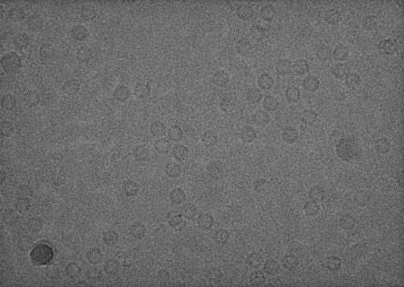
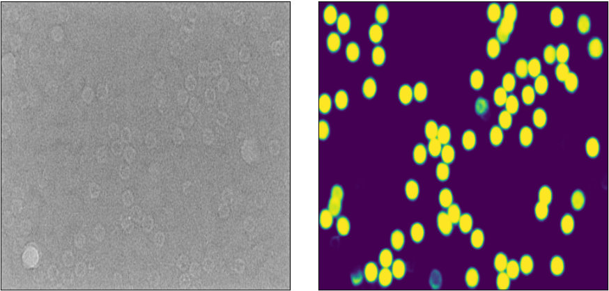
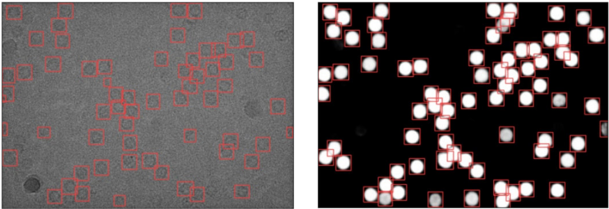

# Segmentation_and_Object_Detection_Apoferritin

In this repository, I implement a UNET architecture and apply a YOLOv8 object detection model for the identification of apoferritin complexes in Cryo-Electron Microscopy data. Cryo-EM images often have low contrast (as shown below), making it challenging to locate protein complexes in the data for single-particle reconstruction. To improve performance, I have combined a UNET for semantic segmentation with object detection.

After building the UNET using Keras and training it on 151 images for 100 epochs, I now have a model that can effectively segment apoferritin complexes in the Cryo-EM data (as demonstrated below).

Using YOLOv8 (from Ultralytics) for object detection on the segmented data enables the identification of instances of the apoferritin protein complex in segmented Cryo-EM data which can be used for single-particle reconstruction. A comparison with the previously trained apoferritin detection model shows improved performance in segmented data versus unsegmented data (as illustrated below).

